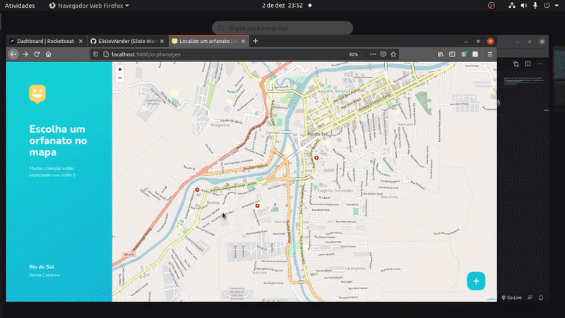

<h1 align="center">
    
</h1>


<h1 align="center">
    
</h1>

## 🏷️ Sobre 
**Happy** é uma plataforma para cadastrar casas que abrigam crianças e adolecentes que se encontram em situação de vulnerabilidade social, afim de que outras pessoas encontre esses locais com mais facilidade para que possam ajudar essas crianças. É um projeto desenvolvido durante o evento Next Level Week 2ª edição, feito pela 🚀[Rocketseat](https://rocketseat.com.br/) e ministrado pelo professor [Mayk Brito](https://github.com/maykbrito). A aplicação foi criada com fins didáticos, para que devs de todas as partes do Brasil pudessem, de graça, criar uma aplicação web do início ao fim.


---

## 🛠️ Tecnologias utilizadas
Foram utilizadas as seguintes tecnologias para desenvolver a aplicação **Ecoleta** :

- HTML
- CSS
- JavaScript
- Node.js
- HBS
- SQLite-async

---

## 🗂️ Como baixar e iniciar o projeto e 

```bash

    #clonar o projeto
    $ git clone https://github.com/ElisioWander/-happy-next-level-week-03.git

    #entrar no diretório
    $ cd nlw

    #instalar as dependências
    $ npm install

    #iniciar a aplicação
    $ npm start
```
### Servidor local
localhost:5000

---

## Autor
### 👤 Elisio Wander

- Twitter: [@elisioWander](https://twitter.com/Elisio741)
- Linkedin: [@elisioWander](https://www.linkedin.com/in/elisio-wander-b88b69136/)
- github: [@elisioWander](https://github.com/ElisioWander)

---

### Desenvolvido 💜 by Elisio Wander
